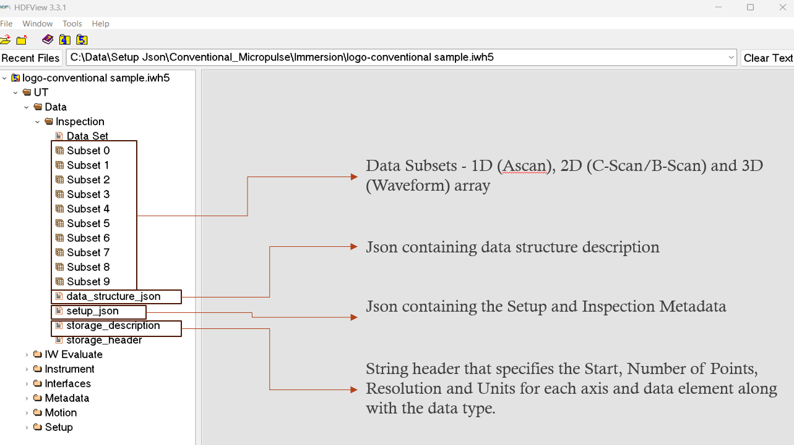

# IWH5 Data File Structures

This section provides a visual representation of the IWH5 organization used in Non-Destructive Testing (NDT) data files. It focuses on the layout and format of two primary data types:

- Ultrasonic Testing (UT)

- Eddy Current Testing (ET)

Each structure is illustrated with labeled sample file to assist developers and analysts in understanding how IWH5 organizes and stores inspection data.

<figure markdown>
<figcaption>IWH5 UT Sample Structure</figcaption>
{ width="800" }
</figure>

<figure markdown>
<figcaption>IWH5 ET Sample Structure</figcaption>
{ width="800" }
</figure>
