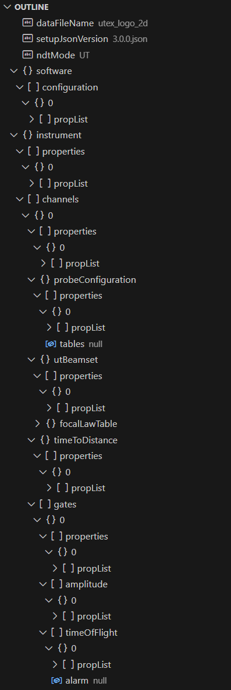
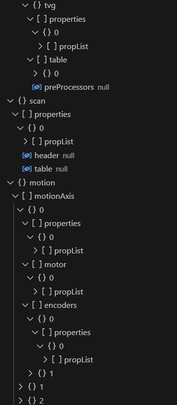

??? info "View setup_json example"
    ```json
        {
        "dataFileName": "utex_logo_2d",
        "setupJsonVersion": "3.0.0.json",
        "ndtMode": "UT",
        "software": {
            "configuration": [
                {
                    "propList": [
                        {
                            "name": "Setup File Version",
                            "displayName": null,
                            "value": "4",
                            "units": "",
                            "type": "Int32"
                        },
                        {
                            "name": "Setup File Name",
                            "displayName": null,
                            "value": "fpx_128_utexlogo.iws",
                            "units": "",
                            "type": "String"
                        },
                        {
                            "name": "Setup File Path",
                            "displayName": null,
                            "value": "C:\\Users\\utextech\\Desktop\\IW Scan\\fpx_128_utexlogo.iws",
                            "units": "",
                            "type": "String"
                        },
                        {
                            "name": "Application Name",
                            "displayName": null,
                            "value": "IW Scan",
                            "units": "",
                            "type": "String"
                        },
                        {
                            "name": "Application Version Name",
                            "displayName": null,
                            "value": "1.2-R1",
                            "units": "",
                            "type": "String"
                        },
                        {
                            "name": "Scan Type",
                            "displayName": null,
                            "value": "2 Axis Scan",
                            "units": "",
                            "type": "String"
                        },
                        {
                            "name": "Digitizer Type",
                            "displayName": null,
                            "value": "OpenView A Scans",
                            "units": "",
                            "type": "String"
                        },
                        {
                            "name": "Distance Units",
                            "displayName": null,
                            "value": "mm",
                            "units": "",
                            "type": "String"
                        },
                        {
                            "name": "Velocity Units",
                            "displayName": null,
                            "value": "mm/us",
                            "units": "",
                            "type": "String"
                        },
                        {
                            "name": "Display Units",
                            "displayName": null,
                            "value": "mm",
                            "units": "",
                            "type": "String"
                        }
                    ]
                }
            ]
        },
        "instrument": {
            "properties": [
                {
                    "propList": [
                        {
                            "name": "Name",
                            "displayName": null,
                            "value": "Focus PX",
                            "units": "",
                            "type": "String"
                        },
                        {
                            "name": "Number of Channels",
                            "displayName": null,
                            "value": "1",
                            "units": "",
                            "type": "Int32"
                        },
                        {
                            "name": "Preferred Collection Mode",
                            "displayName": null,
                            "value": "Position Stamped",
                            "units": "",
                            "type": "String"
                        }
                    ]
                }
            ],
            "channels": [
                {
                    "properties": [
                        {
                            "propList": [
                                {
                                    "name": "Name",
                                    "displayName": null,
                                    "value": "Linear Sweep Ch A",
                                    "units": "",
                                    "type": "String"
                                },
                                {
                                    "name": "Pulse Repetition Rate",
                                    "displayName": null,
                                    "value": "1000",
                                    "units": "",
                                    "type": "Double"
                                },
                                {
                                    "name": "Gain",
                                    "displayName": null,
                                    "value": "17",
                                    "units": "dB",
                                    "type": "Double"
                                },
                                {
                                    "name": "Rectification",
                                    "displayName": null,
                                    "value": "Full Wave",
                                    "units": "",
                                    "type": "String"
                                },
                                {
                                    "name": "Range",
                                    "displayName": null,
                                    "value": "8.475",
                                    "units": "us",
                                    "type": "Double"
                                },
                                {
                                    "name": "End",
                                    "displayName": null,
                                    "value": "33.807",
                                    "units": "us",
                                    "type": "Double"
                                },
                                {
                                    "name": "Merge Data Mode",
                                    "displayName": null,
                                    "value": "Replace",
                                    "units": "",
                                    "type": "String"
                                },
                                {
                                    "name": "Scan Axis Offset",
                                    "displayName": null,
                                    "value": "0",
                                    "units": "mm",
                                    "type": "Double"
                                },
                                {
                                    "name": "Index Axis Offset",
                                    "displayName": null,
                                    "value": "0",
                                    "units": "mm",
                                    "type": "Double"
                                },
                                {
                                    "name": "AScan Time Axis Resolution Raw",
                                    "displayName": null,
                                    "value": "0.05",
                                    "units": "us",
                                    "type": "Double"
                                },
                                {
                                    "name": "AScan Amplitude Resolution",
                                    "displayName": null,
                                    "value": "0.39",
                                    "units": "%",
                                    "type": "Double"
                                }
                            ]
                        }
                    ],
                    "probeConfiguration": {
                        "properties": [
                            {
                                "propList": [
                                    {
                                        "name": "Name",
                                        "displayName": null,
                                        "value": "Linear Array",
                                        "units": "",
                                        "type": "String"
                                    },
                                    {
                                        "name": "Transducer Part Number",
                                        "displayName": null,
                                        "value": "",
                                        "units": "",
                                        "type": ""
                                    },
                                    {
                                        "name": "Transducer Serial Number",
                                        "displayName": null,
                                        "value": "",
                                        "units": "",
                                        "type": ""
                                    },
                                    {
                                        "name": "Probe Type",
                                        "displayName": null,
                                        "value": "Linear Array",
                                        "units": "",
                                        "type": "String"
                                    },
                                    {
                                        "name": "Number Of Elements X",
                                        "displayName": null,
                                        "value": "128",
                                        "units": "",
                                        "type": "Int32"
                                    },
                                    {
                                        "name": "Element Pitch X",
                                        "displayName": null,
                                        "value": "0.75",
                                        "units": "mm",
                                        "type": "Double"
                                    },
                                    {
                                        "name": "Element Width X",
                                        "displayName": null,
                                        "value": "0.5",
                                        "units": "mm",
                                        "type": "Double"
                                    },
                                    {
                                        "name": "Element Width Y",
                                        "displayName": null,
                                        "value": "10",
                                        "units": "mm",
                                        "type": "Double"
                                    },
                                    {
                                        "name": "Focusing Type",
                                        "displayName": null,
                                        "value": "Unfocused",
                                        "units": "",
                                        "type": "String"
                                    },
                                    {
                                        "name": "Focal Length",
                                        "displayName": null,
                                        "value": "25",
                                        "units": "mm",
                                        "type": "Double"
                                    },
                                    {
                                        "name": "Element Map",
                                        "displayName": null,
                                        "value": "Normal",
                                        "units": "",
                                        "type": "String"
                                    },
                                    {
                                        "name": "Frequency",
                                        "displayName": null,
                                        "value": "5",
                                        "units": "",
                                        "type": "Double"
                                    },
                                    {
                                        "name": "Interface Type",
                                        "displayName": null,
                                        "value": "Immersion",
                                        "units": "",
                                        "type": "String"
                                    },
                                    {
                                        "name": "Beam Angle in Couplant",
                                        "displayName": null,
                                        "value": "0",
                                        "units": "deg",
                                        "type": "Double"
                                    },
                                    {
                                        "name": "Wedge Angle",
                                        "displayName": null,
                                        "value": "0",
                                        "units": "deg",
                                        "type": "Double"
                                    },
                                    {
                                        "name": "Path In Couplant",
                                        "displayName": null,
                                        "value": "20",
                                        "units": "mm",
                                        "type": "Double"
                                    },
                                    {
                                        "name": "Height At First Element",
                                        "displayName": null,
                                        "value": "20",
                                        "units": "mm",
                                        "type": "Double"
                                    },
                                    {
                                        "name": "Couplant Material",
                                        "displayName": null,
                                        "value": "Water",
                                        "units": "",
                                        "type": "String"
                                    },
                                    {
                                        "name": "Couplant Velocity of Sound",
                                        "displayName": null,
                                        "value": "1.48",
                                        "units": "mm/us",
                                        "type": "Double"
                                    },
                                    {
                                        "name": "Wedge Length",
                                        "displayName": null,
                                        "value": "1",
                                        "units": "mm",
                                        "type": "Double"
                                    },
                                    {
                                        "name": "Wedge Height",
                                        "displayName": null,
                                        "value": "1",
                                        "units": "mm",
                                        "type": "Double"
                                    },
                                    {
                                        "name": "Wedge Exit Point",
                                        "displayName": null,
                                        "value": "1",
                                        "units": "mm",
                                        "type": "Double"
                                    },
                                    {
                                        "name": "Wedge Width",
                                        "displayName": null,
                                        "value": "1",
                                        "units": "mm",
                                        "type": "Double"
                                    },
                                    {
                                        "name": "Material",
                                        "displayName": null,
                                        "value": "Steel 1095",
                                        "units": "",
                                        "type": "String"
                                    },
                                    {
                                        "name": "Longitudinal Velocity",
                                        "displayName": null,
                                        "value": "5.9",
                                        "units": "mm/us",
                                        "type": "Double"
                                    },
                                    {
                                        "name": "Probe Orientation",
                                        "displayName": null,
                                        "value": "Index Axis",
                                        "units": "",
                                        "type": "String"
                                    },
                                    {
                                        "name": "Scanning Direction",
                                        "displayName": null,
                                        "value": "Length",
                                        "units": "",
                                        "type": "String"
                                    },
                                    {
                                        "name": "Manufacturer",
                                        "displayName": null,
                                        "value": "",
                                        "units": "",
                                        "type": ""
                                    }
                                ]
                            }
                        ],
                        "tables": null
                    },
                    "utBeamset": {
                        "properties": [
                            {
                                "propList": [
                                    {
                                        "name": "Inspection Mode",
                                        "displayName": null,
                                        "value": "Longitudinal",
                                        "units": "",
                                        "type": "String"
                                    },
                                    {
                                        "name": "Focus Type",
                                        "displayName": null,
                                        "value": "None",
                                        "units": "",
                                        "type": "String"
                                    },
                                    {
                                        "name": "Beam Angle",
                                        "displayName": null,
                                        "value": "0",
                                        "units": "deg",
                                        "type": "Double"
                                    },
                                    {
                                        "name": "First Element",
                                        "displayName": null,
                                        "value": "1",
                                        "units": "",
                                        "type": "Int32"
                                    },
                                    {
                                        "name": "Aperture",
                                        "displayName": null,
                                        "value": "16",
                                        "units": "",
                                        "type": "Int32"
                                    },
                                    {
                                        "name": "Element Step",
                                        "displayName": null,
                                        "value": "1",
                                        "units": "",
                                        "type": "Int32"
                                    },
                                    {
                                        "name": "Linear Start",
                                        "displayName": null,
                                        "value": "0",
                                        "units": "",
                                        "type": "Double"
                                    },
                                    {
                                        "name": "Number of Beams",
                                        "displayName": null,
                                        "value": "113",
                                        "units": "",
                                        "type": "Int32"
                                    }
                                ]
                            }
                        ],
                        "focalLawTable": {
                            "name": "Focal Law Table",
                            "description": null,
                            "ColumnNames": "Angle,Rx Angle,Skew,Rx Skew,X Offset,Y Offset,Scan Offset,Index Offset,Tx Interface Trim Delay,Rx Interface Trim Delay,Transmit Trim Delay,Receive Trim Delay,Trim Gain,Total Delay,Transmit Elements,Transmit Channels,Tx Delays,Receive Elements,Receive Channels,Rx Delays",
                            "columnDisplayNames": "Angle,Rx Angle,Skew,Rx Skew,X Offset,Y Offset,Scan Offset,Index Offset,Tx Interface Trim Delay,Rx Interface Trim Delay,Transmit Trim Delay,Receive Trim Delay,Trim Gain,Total Delay,Transmit Elements,Transmit Channels,Tx Delays,Receive Elements,Receive Channels,Rx Delays",
                            "columnUnits": ",,,,mm,mm,mm,,,,,,,,,,,,,",
                            "tableValues": "0,0,0,0,5.62,0,0,5.625,0,0,0,0,0,0,1-16,1-16,0|0|0|0|0|0|0|0|0|0|0|0|0|0|0|0,1-16,1-16,0|0|0|0|0|0|0|0|0|0|0|0|0|0|0|0;0,0,0,0,6.38,0,0,6.375,0,0,0,0,0,0,2-17,2-17,0|0|0|0|0|0|0|0|0|0|0|0|0|0|0|0,2-17,2-17,0|0|0|0|0|0|0|0|0|0|0|0|0|0|0|0;0,0,0,0,7.12,0,0,7.125,0,0,0,0,0,0,3-18,3-18,0|0|0|0|0|0|0|0|0|0|0|0|0|0|0|0,3-18,3-18,0|0|0|0|0|0|0|0|0|0|0|0|0|0|0|0;0,0,0,0,7.88,0,0,7.875,0,0,0,0,0,0,4-19,4-19,0|0|0|0|0|0|0|0|0|0|0|0|0|0|0|0,4-19,4-19,0|0|0|0|0|0|0|0|0|0|0|0|0|0|0|0;0,0,0,0,8.62,0,0,8.625,0,0,0,0,0,0,5-20,5-20,0|0|0|0|0|0|0|0|0|0|0|0|0|0|0|0,5-20,5-20,0|0|0|0|0|0|0|0|0|0|0|0|0|0|0|0;0,0,0,0,9.38,0,0,9.375,0,0,0,0,0,0,6-21,6-21,0|0|0|0|0|0|0|0|0|0|0|0|0|0|0|0,6-21,6-21,0|0|0|0|0|0|0|0|0|0|0|0|0|0|0|0;0,0,0,0,10.12,0,0,10.125,0,0,0,0,0,0,7-22,7-22,0|0|0|0|0|0|0|0|0|0|0|0|0|0|0|0,7-22,7-22,0|0|0|0|0|0|0|0|0|0|0|0|0|0|0|0;0,0,0,0,10.88,0,0,10.875,0,0,0,0,0,0,8-23,8-23,0|0|0|0|0|0|0|0|0|0|0|0|0|0|0|0,8-23,8-23,0|0|0|0|0|0|0|0|0|0|0|0|0|0|0|0;0,0,0,0,11.62,0,0,11.625,0,0,0,0,0,0,9-24,9-24,0|0|0|0|0|0|0|0|0|0|0|0|0|0|0|0,9-24,9-24,0|0|0|0|0|0|0|0|0|0|0|0|0|0|0|0;0,0,0,0,12.38,0,0,12.375,0,0,0,0,0,0,10-25,10-25,0|0|0|0|0|0|0|0|0|0|0|0|0|0|0|0,10-25,10-25,0|0|0|0|0|0|0|0|0|0|0|0|0|0|0|0;0,0,0,0,13.12,0,0,13.125,0,0,0,0,0,0,11-26,11-26,0|0|0|0|0|0|0|0|0|0|0|0|0|0|0|0,11-26,11-26,0|0|0|0|0|0|0|0|0|0|0|0|0|0|0|0;0,0,0,0,13.88,0,0,13.875,0,0,0,0,0,0,12-27,12-27,0|0|0|0|0|0|0|0|0|0|0|0|0|0|0|0,12-27,12-27,0|0|0|0|0|0|0|0|0|0|0|0|0|0|0|0;0,0,0,0,14.62,0,0,14.625,0,0,0,0,0,0,13-28,13-28,0|0|0|0|0|0|0|0|0|0|0|0|0|0|0|0,13-28,13-28,0|0|0|0|0|0|0|0|0|0|0|0|0|0|0|0;0,0,0,0,15.38,0,0,15.375,0,0,0,0,0,0,14-29,14-29,0|0|0|0|0|0|0|0|0|0|0|0|0|0|0|0,14-29,14-29,0|0|0|0|0|0|0|0|0|0|0|0|0|0|0|0;0,0,0,0,16.12,0,0,16.125,0,0,0,0,0,0,15-30,15-30,0|0|0|0|0|0|0|0|0|0|0|0|0|0|0|0,15-30,15-30,0|0|0|0|0|0|0|0|0|0|0|0|0|0|0|0;0,0,0,0,16.88,0,0,16.875,0,0,0,0,0,0,16-31,16-31,0|0|0|0|0|0|0|0|0|0|0|0|0|0|0|0,16-31,16-31,0|0|0|0|0|0|0|0|0|0|0|0|0|0|0|0;0,0,0,0,17.62,0,0,17.625,0,0,0,0,0,0,17-32,17-32,0|0|0|0|0|0|0|0|0|0|0|0|0|0|0|0,17-32,17-32,0|0|0|0|0|0|0|0|0|0|0|0|0|0|0|0;0,0,0,0,18.38,0,0,18.375,0,0,0,0,0,0,18-33,18-33,0|0|0|0|0|0|0|0|0|0|0|0|0|0|0|0,18-33,18-33,0|0|0|0|0|0|0|0|0|0|0|0|0|0|0|0;0,0,0,0,19.12,0,0,19.125,0,0,0,0,0,0,19-34,19-34,0|0|0|0|0|0|0|0|0|0|0|0|0|0|0|0,19-34,19-34,0|0|0|0|0|0|0|0|0|0|0|0|0|0|0|0;0,0,0,0,19.88,0,0,19.875,0,0,0,0,0,0,20-35,20-35,0|0|0|0|0|0|0|0|0|0|0|0|0|0|0|0,20-35,20-35,0|0|0|0|0|0|0|0|0|0|0|0|0|0|0|0;0,0,0,0,20.62,0,0,20.625,0,0,0,0,0,0,21-36,21-36,0|0|0|0|0|0|0|0|0|0|0|0|0|0|0|0,21-36,21-36,0|0|0|0|0|0|0|0|0|0|0|0|0|0|0|0;0,0,0,0,21.38,0,0,21.375,0,0,0,0,0,0,22-37,22-37,0|0|0|0|0|0|0|0|0|0|0|0|0|0|0|0,22-37,22-37,0|0|0|0|0|0|0|0|0|0|0|0|0|0|0|0;0,0,0,0,22.12,0,0,22.125,0,0,0,0,0,0,23-38,23-38,0|0|0|0|0|0|0|0|0|0|0|0|0|0|0|0,23-38,23-38,0|0|0|0|0|0|0|0|0|0|0|0|0|0|0|0;0,0,0,0,22.88,0,0,22.875,0,0,0,0,0,0,24-39,24-39,0|0|0|0|0|0|0|0|0|0|0|0|0|0|0|0,24-39,24-39,0|0|0|0|0|0|0|0|0|0|0|0|0|0|0|0;0,0,0,0,23.62,0,0,23.625,0,0,0,0,0,0,25-40,25-40,0|0|0|0|0|0|0|0|0|0|0|0|0|0|0|0,25-40,25-40,0|0|0|0|0|0|0|0|0|0|0|0|0|0|0|0;0,0,0,0,24.38,0,0,24.375,0,0,0,0,0,0,26-41,26-41,0|0|0|0|0|0|0|0|0|0|0|0|0|0|0|0,26-41,26-41,0|0|0|0|0|0|0|0|0|0|0|0|0|0|0|0;0,0,0,0,25.12,0,0,25.125,0,0,0,0,0,0,27-42,27-42,0|0|0|0|0|0|0|0|0|0|0|0|0|0|0|0,27-42,27-42,0|0|0|0|0|0|0|0|0|0|0|0|0|0|0|0;0,0,0,0,25.88,0,0,25.875,0,0,0,0,0,0,28-43,28-43,0|0|0|0|0|0|0|0|0|0|0|0|0|0|0|0,28-43,28-43,0|0|0|0|0|0|0|0|0|0|0|0|0|0|0|0;0,0,0,0,26.62,0,0,26.625,0,0,0,0,0,0,29-44,29-44,0|0|0|0|0|0|0|0|0|0|0|0|0|0|0|0,29-44,29-44,0|0|0|0|0|0|0|0|0|0|0|0|0|0|0|0;0,0,0,0,27.38,0,0,27.375,0,0,0,0,0,0,30-45,30-45,0|0|0|0|0|0|0|0|0|0|0|0|0|0|0|0,30-45,30-45,0|0|0|0|0|0|0|0|0|0|0|0|0|0|0|0;0,0,0,0,28.12,0,0,28.125,0,0,0,0,0,0,31-46,31-46,0|0|0|0|0|0|0|0|0|0|0|0|0|0|0|0,31-46,31-46,0|0|0|0|0|0|0|0|0|0|0|0|0|0|0|0;0,0,0,0,28.88,0,0,28.875,0,0,0,0,0,0,32-47,32-47,0|0|0|0|0|0|0|0|0|0|0|0|0|0|0|0,32-47,32-47,0|0|0|0|0|0|0|0|0|0|0|0|0|0|0|0;0,0,0,0,29.62,0,0,29.625,0,0,0,0,0,0,33-48,33-48,0|0|0|0|0|0|0|0|0|0|0|0|0|0|0|0,33-48,33-48,0|0|0|0|0|0|0|0|0|0|0|0|0|0|0|0;0,0,0,0,30.38,0,0,30.375,0,0,0,0,0,0,34-49,34-49,0|0|0|0|0|0|0|0|0|0|0|0|0|0|0|0,34-49,34-49,0|0|0|0|0|0|0|0|0|0|0|0|0|0|0|0;0,0,0,0,31.12,0,0,31.125,0,0,0,0,0,0,35-50,35-50,0|0|0|0|0|0|0|0|0|0|0|0|0|0|0|0,35-50,35-50,0|0|0|0|0|0|0|0|0|0|0|0|0|0|0|0;0,0,0,0,31.88,0,0,31.875,0,0,0,0,0,0,36-51,36-51,0|0|0|0|0|0|0|0|0|0|0|0|0|0|0|0,36-51,36-51,0|0|0|0|0|0|0|0|0|0|0|0|0|0|0|0;0,0,0,0,32.62,0,0,32.625,0,0,0,0,0,0,37-52,37-52,0|0|0|0|0|0|0|0|0|0|0|0|0|0|0|0,37-52,37-52,0|0|0|0|0|0|0|0|0|0|0|0|0|0|0|0;0,0,0,0,33.38,0,0,33.375,0,0,0,0,0,0,38-53,38-53,0|0|0|0|0|0|0|0|0|0|0|0|0|0|0|0,38-53,38-53,0|0|0|0|0|0|0|0|0|0|0|0|0|0|0|0;0,0,0,0,34.12,0,0,34.125,0,0,0,0,0,0,39-54,39-54,0|0|0|0|0|0|0|0|0|0|0|0|0|0|0|0,39-54,39-54,0|0|0|0|0|0|0|0|0|0|0|0|0|0|0|0;0,0,0,0,34.88,0,0,34.875,0,0,0,0,0,0,40-55,40-55,0|0|0|0|0|0|0|0|0|0|0|0|0|0|0|0,40-55,40-55,0|0|0|0|0|0|0|0|0|0|0|0|0|0|0|0;0,0,0,0,35.62,0,0,35.625,0,0,0,0,0,0,41-56,41-56,0|0|0|0|0|0|0|0|0|0|0|0|0|0|0|0,41-56,41-56,0|0|0|0|0|0|0|0|0|0|0|0|0|0|0|0;0,0,0,0,36.38,0,0,36.375,0,0,0,0,0,0,42-57,42-57,0|0|0|0|0|0|0|0|0|0|0|0|0|0|0|0,42-57,42-57,0|0|0|0|0|0|0|0|0|0|0|0|0|0|0|0;0,0,0,0,37.12,0,0,37.125,0,0,0,0,0,0,43-58,43-58,0|0|0|0|0|0|0|0|0|0|0|0|0|0|0|0,43-58,43-58,0|0|0|0|0|0|0|0|0|0|0|0|0|0|0|0;0,0,0,0,37.88,0,0,37.875,0,0,0,0,0,0,44-59,44-59,0|0|0|0|0|0|0|0|0|0|0|0|0|0|0|0,44-59,44-59,0|0|0|0|0|0|0|0|0|0|0|0|0|0|0|0;0,0,0,0,38.62,0,0,38.625,0,0,0,0,0,0,45-60,45-60,0|0|0|0|0|0|0|0|0|0|0|0|0|0|0|0,45-60,45-60,0|0|0|0|0|0|0|0|0|0|0|0|0|0|0|0;0,0,0,0,39.38,0,0,39.375,0,0,0,0,0,0,46-61,46-61,0|0|0|0|0|0|0|0|0|0|0|0|0|0|0|0,46-61,46-61,0|0|0|0|0|0|0|0|0|0|0|0|0|0|0|0;0,0,0,0,40.12,0,0,40.125,0,0,0,0,0,0,47-62,47-62,0|0|0|0|0|0|0|0|0|0|0|0|0|0|0|0,47-62,47-62,0|0|0|0|0|0|0|0|0|0|0|0|0|0|0|0;0,0,0,0,40.88,0,0,40.875,0,0,0,0,0,0,48-63,48-63,0|0|0|0|0|0|0|0|0|0|0|0|0|0|0|0,48-63,48-63,0|0|0|0|0|0|0|0|0|0|0|0|0|0|0|0;0,0,0,0,41.62,0,0,41.625,0,0,0,0,0,0,49-64,49-64,0|0|0|0|0|0|0|0|0|0|0|0|0|0|0|0,49-64,49-64,0|0|0|0|0|0|0|0|0|0|0|0|0|0|0|0;0,0,0,0,42.38,0,0,42.375,0,0,0,0,0,0,50-65,50-65,0|0|0|0|0|0|0|0|0|0|0|0|0|0|0|0,50-65,50-65,0|0|0|0|0|0|0|0|0|0|0|0|0|0|0|0;0,0,0,0,43.12,0,0,43.125,0,0,0,0,0,0,51-66,51-66,0|0|0|0|0|0|0|0|0|0|0|0|0|0|0|0,51-66,51-66,0|0|0|0|0|0|0|0|0|0|0|0|0|0|0|0;0,0,0,0,43.88,0,0,43.875,0,0,0,0,0,0,52-67,52-67,0|0|0|0|0|0|0|0|0|0|0|0|0|0|0|0,52-67,52-67,0|0|0|0|0|0|0|0|0|0|0|0|0|0|0|0;0,0,0,0,44.62,0,0,44.625,0,0,0,0,0,0,53-68,53-68,0|0|0|0|0|0|0|0|0|0|0|0|0|0|0|0,53-68,53-68,0|0|0|0|0|0|0|0|0|0|0|0|0|0|0|0;0,0,0,0,45.38,0,0,45.375,0,0,0,0,0,0,54-69,54-69,0|0|0|0|0|0|0|0|0|0|0|0|0|0|0|0,54-69,54-69,0|0|0|0|0|0|0|0|0|0|0|0|0|0|0|0;0,0,0,0,46.12,0,0,46.125,0,0,0,0,0,0,55-70,55-70,0|0|0|0|0|0|0|0|0|0|0|0|0|0|0|0,55-70,55-70,0|0|0|0|0|0|0|0|0|0|0|0|0|0|0|0;0,0,0,0,46.88,0,0,46.875,0,0,0,0,0,0,56-71,56-71,0|0|0|0|0|0|0|0|0|0|0|0|0|0|0|0,56-71,56-71,0|0|0|0|0|0|0|0|0|0|0|0|0|0|0|0;0,0,0,0,47.62,0,0,47.625,0,0,0,0,0,0,57-72,57-72,0|0|0|0|0|0|0|0|0|0|0|0|0|0|0|0,57-72,57-72,0|0|0|0|0|0|0|0|0|0|0|0|0|0|0|0;0,0,0,0,48.38,0,0,48.375,0,0,0,0,0,0,58-73,58-73,0|0|0|0|0|0|0|0|0|0|0|0|0|0|0|0,58-73,58-73,0|0|0|0|0|0|0|0|0|0|0|0|0|0|0|0;0,0,0,0,49.12,0,0,49.125,0,0,0,0,0,0,59-74,59-74,0|0|0|0|0|0|0|0|0|0|0|0|0|0|0|0,59-74,59-74,0|0|0|0|0|0|0|0|0|0|0|0|0|0|0|0;0,0,0,0,49.88,0,0,49.875,0,0,0,0,0,0,60-75,60-75,0|0|0|0|0|0|0|0|0|0|0|0|0|0|0|0,60-75,60-75,0|0|0|0|0|0|0|0|0|0|0|0|0|0|0|0;0,0,0,0,50.62,0,0,50.625,0,0,0,0,0,0,61-76,61-76,0|0|0|0|0|0|0|0|0|0|0|0|0|0|0|0,61-76,61-76,0|0|0|0|0|0|0|0|0|0|0|0|0|0|0|0;0,0,0,0,51.38,0,0,51.375,0,0,0,0,0,0,62-77,62-77,0|0|0|0|0|0|0|0|0|0|0|0|0|0|0|0,62-77,62-77,0|0|0|0|0|0|0|0|0|0|0|0|0|0|0|0;0,0,0,0,52.12,0,0,52.125,0,0,0,0,0,0,63-78,63-78,0|0|0|0|0|0|0|0|0|0|0|0|0|0|0|0,63-78,63-78,0|0|0|0|0|0|0|0|0|0|0|0|0|0|0|0;0,0,0,0,52.88,0,0,52.875,0,0,0,0,0,0,64-79,64-79,0|0|0|0|0|0|0|0|0|0|0|0|0|0|0|0,64-79,64-79,0|0|0|0|0|0|0|0|0|0|0|0|0|0|0|0;0,0,0,0,53.62,0,0,53.625,0,0,0,0,0,0,65-80,65-80,0|0|0|0|0|0|0|0|0|0|0|0|0|0|0|0,65-80,65-80,0|0|0|0|0|0|0|0|0|0|0|0|0|0|0|0;0,0,0,0,54.38,0,0,54.375,0,0,0,0,0,0,66-81,66-81,0|0|0|0|0|0|0|0|0|0|0|0|0|0|0|0,66-81,66-81,0|0|0|0|0|0|0|0|0|0|0|0|0|0|0|0;0,0,0,0,55.12,0,0,55.125,0,0,0,0,0,0,67-82,67-82,0|0|0|0|0|0|0|0|0|0|0|0|0|0|0|0,67-82,67-82,0|0|0|0|0|0|0|0|0|0|0|0|0|0|0|0;0,0,0,0,55.88,0,0,55.875,0,0,0,0,0,0,68-83,68-83,0|0|0|0|0|0|0|0|0|0|0|0|0|0|0|0,68-83,68-83,0|0|0|0|0|0|0|0|0|0|0|0|0|0|0|0;0,0,0,0,56.62,0,0,56.625,0,0,0,0,0,0,69-84,69-84,0|0|0|0|0|0|0|0|0|0|0|0|0|0|0|0,69-84,69-84,0|0|0|0|0|0|0|0|0|0|0|0|0|0|0|0;0,0,0,0,57.38,0,0,57.375,0,0,0,0,0,0,70-85,70-85,0|0|0|0|0|0|0|0|0|0|0|0|0|0|0|0,70-85,70-85,0|0|0|0|0|0|0|0|0|0|0|0|0|0|0|0;0,0,0,0,58.12,0,0,58.125,0,0,0,0,0,0,71-86,71-86,0|0|0|0|0|0|0|0|0|0|0|0|0|0|0|0,71-86,71-86,0|0|0|0|0|0|0|0|0|0|0|0|0|0|0|0;0,0,0,0,58.88,0,0,58.875,0,0,0,0,0,0,72-87,72-87,0|0|0|0|0|0|0|0|0|0|0|0|0|0|0|0,72-87,72-87,0|0|0|0|0|0|0|0|0|0|0|0|0|0|0|0;0,0,0,0,59.62,0,0,59.625,0,0,0,0,0,0,73-88,73-88,0|0|0|0|0|0|0|0|0|0|0|0|0|0|0|0,73-88,73-88,0|0|0|0|0|0|0|0|0|0|0|0|0|0|0|0;0,0,0,0,60.38,0,0,60.375,0,0,0,0,0,0,74-89,74-89,0|0|0|0|0|0|0|0|0|0|0|0|0|0|0|0,74-89,74-89,0|0|0|0|0|0|0|0|0|0|0|0|0|0|0|0;0,0,0,0,61.12,0,0,61.125,0,0,0,0,0,0,75-90,75-90,0|0|0|0|0|0|0|0|0|0|0|0|0|0|0|0,75-90,75-90,0|0|0|0|0|0|0|0|0|0|0|0|0|0|0|0;0,0,0,0,61.88,0,0,61.875,0,0,0,0,0,0,76-91,76-91,0|0|0|0|0|0|0|0|0|0|0|0|0|0|0|0,76-91,76-91,0|0|0|0|0|0|0|0|0|0|0|0|0|0|0|0;0,0,0,0,62.62,0,0,62.625,0,0,0,0,0,0,77-92,77-92,0|0|0|0|0|0|0|0|0|0|0|0|0|0|0|0,77-92,77-92,0|0|0|0|0|0|0|0|0|0|0|0|0|0|0|0;0,0,0,0,63.38,0,0,63.375,0,0,0,0,0,0,78-93,78-93,0|0|0|0|0|0|0|0|0|0|0|0|0|0|0|0,78-93,78-93,0|0|0|0|0|0|0|0|0|0|0|0|0|0|0|0;0,0,0,0,64.12,0,0,64.125,0,0,0,0,0,0,79-94,79-94,0|0|0|0|0|0|0|0|0|0|0|0|0|0|0|0,79-94,79-94,0|0|0|0|0|0|0|0|0|0|0|0|0|0|0|0;0,0,0,0,64.88,0,0,64.875,0,0,0,0,0,0,80-95,80-95,0|0|0|0|0|0|0|0|0|0|0|0|0|0|0|0,80-95,80-95,0|0|0|0|0|0|0|0|0|0|0|0|0|0|0|0;0,0,0,0,65.62,0,0,65.625,0,0,0,0,0,0,81-96,81-96,0|0|0|0|0|0|0|0|0|0|0|0|0|0|0|0,81-96,81-96,0|0|0|0|0|0|0|0|0|0|0|0|0|0|0|0;0,0,0,0,66.38,0,0,66.375,0,0,0,0,0,0,82-97,82-97,0|0|0|0|0|0|0|0|0|0|0|0|0|0|0|0,82-97,82-97,0|0|0|0|0|0|0|0|0|0|0|0|0|0|0|0;0,0,0,0,67.12,0,0,67.125,0,0,0,0,0,0,83-98,83-98,0|0|0|0|0|0|0|0|0|0|0|0|0|0|0|0,83-98,83-98,0|0|0|0|0|0|0|0|0|0|0|0|0|0|0|0;0,0,0,0,67.88,0,0,67.875,0,0,0,0,0,0,84-99,84-99,0|0|0|0|0|0|0|0|0|0|0|0|0|0|0|0,84-99,84-99,0|0|0|0|0|0|0|0|0|0|0|0|0|0|0|0;0,0,0,0,68.62,0,0,68.625,0,0,0,0,0,0,85-100,85-100,0|0|0|0|0|0|0|0|0|0|0|0|0|0|0|0,85-100,85-100,0|0|0|0|0|0|0|0|0|0|0|0|0|0|0|0;0,0,0,0,69.38,0,0,69.375,0,0,0,0,0,0,86-101,86-101,0|0|0|0|0|0|0|0|0|0|0|0|0|0|0|0,86-101,86-101,0|0|0|0|0|0|0|0|0|0|0|0|0|0|0|0;0,0,0,0,70.12,0,0,70.125,0,0,0,0,0,0,87-102,87-102,0|0|0|0|0|0|0|0|0|0|0|0|0|0|0|0,87-102,87-102,0|0|0|0|0|0|0|0|0|0|0|0|0|0|0|0;0,0,0,0,70.88,0,0,70.875,0,0,0,0,0,0,88-103,88-103,0|0|0|0|0|0|0|0|0|0|0|0|0|0|0|0,88-103,88-103,0|0|0|0|0|0|0|0|0|0|0|0|0|0|0|0;0,0,0,0,71.62,0,0,71.625,0,0,0,0,0,0,89-104,89-104,0|0|0|0|0|0|0|0|0|0|0|0|0|0|0|0,89-104,89-104,0|0|0|0|0|0|0|0|0|0|0|0|0|0|0|0;0,0,0,0,72.38,0,0,72.375,0,0,0,0,0,0,90-105,90-105,0|0|0|0|0|0|0|0|0|0|0|0|0|0|0|0,90-105,90-105,0|0|0|0|0|0|0|0|0|0|0|0|0|0|0|0;0,0,0,0,73.12,0,0,73.125,0,0,0,0,0,0,91-106,91-106,0|0|0|0|0|0|0|0|0|0|0|0|0|0|0|0,91-106,91-106,0|0|0|0|0|0|0|0|0|0|0|0|0|0|0|0;0,0,0,0,73.88,0,0,73.875,0,0,0,0,0,0,92-107,92-107,0|0|0|0|0|0|0|0|0|0|0|0|0|0|0|0,92-107,92-107,0|0|0|0|0|0|0|0|0|0|0|0|0|0|0|0;0,0,0,0,74.62,0,0,74.625,0,0,0,0,0,0,93-108,93-108,0|0|0|0|0|0|0|0|0|0|0|0|0|0|0|0,93-108,93-108,0|0|0|0|0|0|0|0|0|0|0|0|0|0|0|0;0,0,0,0,75.38,0,0,75.375,0,0,0,0,0,0,94-109,94-109,0|0|0|0|0|0|0|0|0|0|0|0|0|0|0|0,94-109,94-109,0|0|0|0|0|0|0|0|0|0|0|0|0|0|0|0;0,0,0,0,76.12,0,0,76.125,0,0,0,0,0,0,95-110,95-110,0|0|0|0|0|0|0|0|0|0|0|0|0|0|0|0,95-110,95-110,0|0|0|0|0|0|0|0|0|0|0|0|0|0|0|0;0,0,0,0,76.88,0,0,76.875,0,0,0,0,0,0,96-111,96-111,0|0|0|0|0|0|0|0|0|0|0|0|0|0|0|0,96-111,96-111,0|0|0|0|0|0|0|0|0|0|0|0|0|0|0|0;0,0,0,0,77.62,0,0,77.625,0,0,0,0,0,0,97-112,97-112,0|0|0|0|0|0|0|0|0|0|0|0|0|0|0|0,97-112,97-112,0|0|0|0|0|0|0|0|0|0|0|0|0|0|0|0;0,0,0,0,78.38,0,0,78.375,0,0,0,0,0,0,98-113,98-113,0|0|0|0|0|0|0|0|0|0|0|0|0|0|0|0,98-113,98-113,0|0|0|0|0|0|0|0|0|0|0|0|0|0|0|0;0,0,0,0,79.12,0,0,79.125,0,0,0,0,0,0,99-114,99-114,0|0|0|0|0|0|0|0|0|0|0|0|0|0|0|0,99-114,99-114,0|0|0|0|0|0|0|0|0|0|0|0|0|0|0|0;0,0,0,0,79.88,0,0,79.875,0,0,0,0,0,0,100-115,100-115,0|0|0|0|0|0|0|0|0|0|0|0|0|0|0|0,100-115,100-115,0|0|0|0|0|0|0|0|0|0|0|0|0|0|0|0;0,0,0,0,80.62,0,0,80.625,0,0,0,0,0,0,101-116,101-116,0|0|0|0|0|0|0|0|0|0|0|0|0|0|0|0,101-116,101-116,0|0|0|0|0|0|0|0|0|0|0|0|0|0|0|0;0,0,0,0,81.38,0,0,81.375,0,0,0,0,0,0,102-117,102-117,0|0|0|0|0|0|0|0|0|0|0|0|0|0|0|0,102-117,102-117,0|0|0|0|0|0|0|0|0|0|0|0|0|0|0|0;0,0,0,0,82.12,0,0,82.125,0,0,0,0,0,0,103-118,103-118,0|0|0|0|0|0|0|0|0|0|0|0|0|0|0|0,103-118,103-118,0|0|0|0|0|0|0|0|0|0|0|0|0|0|0|0;0,0,0,0,82.88,0,0,82.875,0,0,0,0,0,0,104-119,104-119,0|0|0|0|0|0|0|0|0|0|0|0|0|0|0|0,104-119,104-119,0|0|0|0|0|0|0|0|0|0|0|0|0|0|0|0;0,0,0,0,83.62,0,0,83.625,0,0,0,0,0,0,105-120,105-120,0|0|0|0|0|0|0|0|0|0|0|0|0|0|0|0,105-120,105-120,0|0|0|0|0|0|0|0|0|0|0|0|0|0|0|0;0,0,0,0,84.38,0,0,84.375,0,0,0,0,0,0,106-121,106-121,0|0|0|0|0|0|0|0|0|0|0|0|0|0|0|0,106-121,106-121,0|0|0|0|0|0|0|0|0|0|0|0|0|0|0|0;0,0,0,0,85.12,0,0,85.125,0,0,0,0,0,0,107-122,107-122,0|0|0|0|0|0|0|0|0|0|0|0|0|0|0|0,107-122,107-122,0|0|0|0|0|0|0|0|0|0|0|0|0|0|0|0;0,0,0,0,85.88,0,0,85.875,0,0,0,0,0,0,108-123,108-123,0|0|0|0|0|0|0|0|0|0|0|0|0|0|0|0,108-123,108-123,0|0|0|0|0|0|0|0|0|0|0|0|0|0|0|0;0,0,0,0,86.62,0,0,86.625,0,0,0,0,0,0,109-124,109-124,0|0|0|0|0|0|0|0|0|0|0|0|0|0|0|0,109-124,109-124,0|0|0|0|0|0|0|0|0|0|0|0|0|0|0|0;0,0,0,0,87.38,0,0,87.375,0,0,0,0,0,0,110-125,110-125,0|0|0|0|0|0|0|0|0|0|0|0|0|0|0|0,110-125,110-125,0|0|0|0|0|0|0|0|0|0|0|0|0|0|0|0;0,0,0,0,88.12,0,0,88.125,0,0,0,0,0,0,111-126,111-126,0|0|0|0|0|0|0|0|0|0|0|0|0|0|0|0,111-126,111-126,0|0|0|0|0|0|0|0|0|0|0|0|0|0|0|0;0,0,0,0,88.88,0,0,88.875,0,0,0,0,0,0,112-127,112-127,0|0|0|0|0|0|0|0|0|0|0|0|0|0|0|0,112-127,112-127,0|0|0|0|0|0|0|0|0|0|0|0|0|0|0|0;0,0,0,0,89.62,0,0,89.625,0,0,0,0,0,0,113-128,113-128,0|0|0|0|0|0|0|0|0|0|0|0|0|0|0|0,113-128,113-128,0|0|0|0|0|0|0|0|0|0|0|0|0|0|0|0"
                        }
                    },
                    "timeToDistance": {
                        "properties": [
                            {
                                "propList": [
                                    {
                                        "name": "Distance Type",
                                        "displayName": null,
                                        "value": "Path",
                                        "units": "",
                                        "type": "String"
                                    }
                                ]
                            }
                        ]
                    },
                    "gates": [
                        {
                            "properties": [
                                {
                                    "propList": [
                                        {
                                            "name": "Name",
                                            "displayName": null,
                                            "value": "IF",
                                            "units": "",
                                            "type": "String"
                                        },
                                        {
                                            "name": "Gate Tag",
                                            "displayName": null,
                                            "value": "",
                                            "units": "",
                                            "type": ""
                                        },
                                        {
                                            "name": "Delay",
                                            "displayName": null,
                                            "value": "26.31",
                                            "units": "us",
                                            "type": "Double"
                                        },
                                        {
                                            "name": "Range",
                                            "displayName": null,
                                            "value": "3.39",
                                            "units": "us",
                                            "type": "Double"
                                        },
                                        {
                                            "name": "Parent Gate",
                                            "displayName": null,
                                            "value": "",
                                            "units": "",
                                            "type": ""
                                        },
                                        {
                                            "name": "Start",
                                            "displayName": null,
                                            "value": "-2.11",
                                            "units": "mm",
                                            "type": "Double"
                                        },
                                        {
                                            "name": "Length",
                                            "displayName": null,
                                            "value": "10",
                                            "units": "mm",
                                            "type": "Double"
                                        },
                                        {
                                            "name": "End",
                                            "displayName": null,
                                            "value": "7.89",
                                            "units": "mm",
                                            "type": "Double"
                                        },
                                        {
                                            "name": "Threshold",
                                            "displayName": null,
                                            "value": "28.99",
                                            "units": "%",
                                            "type": "Double"
                                        },
                                        {
                                            "name": "Relative To",
                                            "displayName": null,
                                            "value": "Interface",
                                            "units": "",
                                            "type": "String"
                                        },
                                        {
                                            "name": "Show Alarm",
                                            "displayName": null,
                                            "value": "False",
                                            "units": "",
                                            "type": "Boolean"
                                        }
                                    ]
                                }
                            ],
                            "amplitude": [
                                {
                                    "propList": [
                                        {
                                            "name": "Amplitude Type",
                                            "displayName": null,
                                            "value": "Peak",
                                            "units": "",
                                            "type": "String"
                                        },
                                        {
                                            "name": "Amplitude Peak",
                                            "displayName": null,
                                            "value": "Maximum",
                                            "units": "",
                                            "type": "String"
                                        },
                                        {
                                            "name": "Interpolate Amplitude",
                                            "displayName": null,
                                            "value": "False",
                                            "units": "",
                                            "type": "Boolean"
                                        },
                                        {
                                            "name": "Absolute",
                                            "displayName": null,
                                            "value": "False",
                                            "units": "",
                                            "type": "Boolean"
                                        }
                                    ]
                                }
                            ],
                            "timeOfFlight": [
                                {
                                    "propList": [
                                        {
                                            "name": "TOF Type",
                                            "displayName": null,
                                            "value": "Threshold",
                                            "units": "",
                                            "type": "String"
                                        },
                                        {
                                            "name": "Trim",
                                            "displayName": null,
                                            "value": "0",
                                            "units": "us",
                                            "type": "Double"
                                        },
                                        {
                                            "name": "Trim Converted",
                                            "displayName": null,
                                            "value": "0",
                                            "units": "mm",
                                            "type": "Double"
                                        },
                                        {
                                            "name": "Relative To",
                                            "displayName": null,
                                            "value": "Interface",
                                            "units": "",
                                            "type": "String"
                                        }
                                    ]
                                }
                            ],
                            "alarm": null
                        },
                        {
                            "properties": [
                                {
                                    "propList": [
                                        {
                                            "name": "Name",
                                            "displayName": null,
                                            "value": "Gate 1",
                                            "units": "",
                                            "type": "String"
                                        },
                                        {
                                            "name": "Gate Tag",
                                            "displayName": null,
                                            "value": "",
                                            "units": "",
                                            "type": ""
                                        },
                                        {
                                            "name": "Delay",
                                            "displayName": null,
                                            "value": "0.927",
                                            "units": "us",
                                            "type": "Double"
                                        },
                                        {
                                            "name": "Range",
                                            "displayName": null,
                                            "value": "2.548",
                                            "units": "us",
                                            "type": "Double"
                                        },
                                        {
                                            "name": "Parent Gate",
                                            "displayName": null,
                                            "value": "",
                                            "units": "",
                                            "type": ""
                                        },
                                        {
                                            "name": "Start",
                                            "displayName": null,
                                            "value": "2.73",
                                            "units": "mm",
                                            "type": "Double"
                                        },
                                        {
                                            "name": "Length",
                                            "displayName": null,
                                            "value": "7.52",
                                            "units": "mm",
                                            "type": "Double"
                                        },
                                        {
                                            "name": "End",
                                            "displayName": null,
                                            "value": "10.25",
                                            "units": "mm",
                                            "type": "Double"
                                        },
                                        {
                                            "name": "Threshold",
                                            "displayName": null,
                                            "value": "15.94",
                                            "units": "%",
                                            "type": "Double"
                                        },
                                        {
                                            "name": "Relative To",
                                            "displayName": null,
                                            "value": "Interface",
                                            "units": "",
                                            "type": "String"
                                        },
                                        {
                                            "name": "Show Alarm",
                                            "displayName": null,
                                            "value": "False",
                                            "units": "",
                                            "type": "Boolean"
                                        }
                                    ]
                                }
                            ],
                            "amplitude": [
                                {
                                    "propList": [
                                        {
                                            "name": "Amplitude Type",
                                            "displayName": null,
                                            "value": "Peak",
                                            "units": "",
                                            "type": "String"
                                        },
                                        {
                                            "name": "Amplitude Peak",
                                            "displayName": null,
                                            "value": "First Peak Over Threshold",
                                            "units": "",
                                            "type": "String"
                                        },
                                        {
                                            "name": "If Amp Peak Below Threshold",
                                            "displayName": null,
                                            "value": "Set To Undefined",
                                            "units": "",
                                            "type": "String"
                                        },
                                        {
                                            "name": "Interpolate Amplitude",
                                            "displayName": null,
                                            "value": "False",
                                            "units": "",
                                            "type": "Boolean"
                                        },
                                        {
                                            "name": "Absolute",
                                            "displayName": null,
                                            "value": "False",
                                            "units": "",
                                            "type": "Boolean"
                                        }
                                    ]
                                }
                            ],
                            "timeOfFlight": [
                                {
                                    "propList": [
                                        {
                                            "name": "TOF Type",
                                            "displayName": null,
                                            "value": "Peak",
                                            "units": "",
                                            "type": "String"
                                        },
                                        {
                                            "name": "TOF Peak",
                                            "displayName": null,
                                            "value": "First Peak Over Threshold",
                                            "units": "",
                                            "type": "String"
                                        },
                                        {
                                            "name": "Measured At",
                                            "displayName": null,
                                            "value": "Peak",
                                            "units": "",
                                            "type": "String"
                                        },
                                        {
                                            "name": "Trim",
                                            "displayName": null,
                                            "value": "0",
                                            "units": "us",
                                            "type": "Double"
                                        },
                                        {
                                            "name": "Trim Converted",
                                            "displayName": null,
                                            "value": "0",
                                            "units": "mm",
                                            "type": "Double"
                                        },
                                        {
                                            "name": "Relative To",
                                            "displayName": null,
                                            "value": "Interface",
                                            "units": "",
                                            "type": "String"
                                        }
                                    ]
                                }
                            ],
                            "alarm": null
                        }
                    ],
                    "tvg": {
                        "properties": [
                            {
                                "propList": [
                                    {
                                        "name": "Simple TVG",
                                        "displayName": null,
                                        "value": "True",
                                        "units": "",
                                        "type": "Boolean"
                                    },
                                    {
                                        "name": "Start",
                                        "displayName": null,
                                        "value": "-79.73",
                                        "units": "mm",
                                        "type": "Double"
                                    },
                                    {
                                        "name": "Auto Level",
                                        "displayName": null,
                                        "value": "0",
                                        "units": "",
                                        "type": "Int32"
                                    },
                                    {
                                        "name": "Number Of Points",
                                        "displayName": null,
                                        "value": "2",
                                        "units": "",
                                        "type": "Int32"
                                    },
                                    {
                                        "name": "Points",
                                        "displayName": null,
                                        "value": "(0,0)(10,10)",
                                        "units": "",
                                        "type": "Object[][]"
                                    }
                                ]
                            }
                        ],
                        "table": [
                            {
                                "name": "TVG",
                                "description": null,
                                "ColumnNames": "Time,Path,Depth,Gain",
                                "columnDisplayNames": "Time,Path,Depth,Gain",
                                "columnUnits": "us,mm,mm,dB",
                                "tableValues": "0,0,0,0;10,29.5,29.5,10"
                            }
                        ]
                    },
                    "preProcessors": null
                }
            ]
        },
        "scan": {
            "properties": [
                {
                    "propList": [
                        {
                            "name": "Motion Pattern",
                            "displayName": null,
                            "value": "Raster",
                            "units": "",
                            "type": "String"
                        },
                        {
                            "name": "Paintbrush",
                            "displayName": null,
                            "value": "",
                            "units": "",
                            "type": ""
                        },
                        {
                            "name": "Swept Array Paintbrush",
                            "displayName": null,
                            "value": "True",
                            "units": "",
                            "type": "Boolean"
                        },
                        {
                            "name": "Start from current position",
                            "displayName": null,
                            "value": "False",
                            "units": "",
                            "type": "Boolean"
                        },
                        {
                            "name": "Set Encoders On Start",
                            "displayName": null,
                            "value": "False",
                            "units": "",
                            "type": "Boolean"
                        },
                        {
                            "name": "Scan Axis",
                            "displayName": null,
                            "value": "X",
                            "units": "",
                            "type": "String"
                        },
                        {
                            "name": "Scan Start",
                            "displayName": null,
                            "value": "0",
                            "units": "mm",
                            "type": "Double"
                        },
                        {
                            "name": "Scan Length",
                            "displayName": null,
                            "value": "80",
                            "units": "mm",
                            "type": "Double"
                        },
                        {
                            "name": "Scan Resolution",
                            "displayName": null,
                            "value": "0.75",
                            "units": "mm",
                            "type": "Double"
                        },
                        {
                            "name": "Specify Backlash In Points",
                            "displayName": null,
                            "value": "False",
                            "units": "",
                            "type": "Boolean"
                        },
                        {
                            "name": "Backlash In Points",
                            "displayName": null,
                            "value": "0",
                            "units": "",
                            "type": "Int32"
                        },
                        {
                            "name": "Index Axis",
                            "displayName": null,
                            "value": "Y",
                            "units": "",
                            "type": "String"
                        },
                        {
                            "name": "Index Start",
                            "displayName": null,
                            "value": "0",
                            "units": "mm",
                            "type": "Double"
                        },
                        {
                            "name": "Index Length",
                            "displayName": null,
                            "value": "150",
                            "units": "mm",
                            "type": "Double"
                        },
                        {
                            "name": "Index Resolution",
                            "displayName": null,
                            "value": "0.75",
                            "units": "mm",
                            "type": "Double"
                        },
                        {
                            "name": "Automatically Clear Data",
                            "displayName": null,
                            "value": "False",
                            "units": "",
                            "type": "Boolean"
                        },
                        {
                            "name": "Paintbrush Mode",
                            "displayName": null,
                            "value": "False",
                            "units": "",
                            "type": "Boolean"
                        },
                        {
                            "name": "Set Scan Encoder To",
                            "displayName": null,
                            "value": "0",
                            "units": "mm",
                            "type": "Double"
                        },
                        {
                            "name": "Set Index Encoder To",
                            "displayName": null,
                            "value": "0",
                            "units": "mm",
                            "type": "Double"
                        }
                    ]
                }
            ],
            "header": null,
            "table": null
        },
        "motion": {
            "motionAxis": [
                {
                    "properties": [
                        {
                            "propList": [
                                {
                                    "name": "Name",
                                    "displayName": null,
                                    "value": "X",
                                    "units": "",
                                    "type": "String"
                                },
                                {
                                    "name": "Low Run Speed",
                                    "displayName": null,
                                    "value": "5",
                                    "units": "%",
                                    "type": "Double"
                                },
                                {
                                    "name": "Medium Run Speed",
                                    "displayName": null,
                                    "value": "20",
                                    "units": "%",
                                    "type": "Double"
                                },
                                {
                                    "name": "High Run Speed",
                                    "displayName": null,
                                    "value": "100",
                                    "units": "%",
                                    "type": "Double"
                                },
                                {
                                    "name": "Low",
                                    "displayName": null,
                                    "value": "2.5",
                                    "units": "",
                                    "type": "Double"
                                },
                                {
                                    "name": "Medium",
                                    "displayName": null,
                                    "value": "10",
                                    "units": "",
                                    "type": "Double"
                                },
                                {
                                    "name": "High",
                                    "displayName": null,
                                    "value": "50",
                                    "units": "",
                                    "type": "Double"
                                },
                                {
                                    "name": "Disable Motion",
                                    "displayName": null,
                                    "value": "None",
                                    "units": "",
                                    "type": "String"
                                },
                                {
                                    "name": "Forward Direction Label",
                                    "displayName": null,
                                    "value": "Forward",
                                    "units": "",
                                    "type": "String"
                                },
                                {
                                    "name": "De-energize Axis After Each Motion",
                                    "displayName": null,
                                    "value": "False",
                                    "units": "",
                                    "type": "Boolean"
                                },
                                {
                                    "name": "Moves Completed if within",
                                    "displayName": null,
                                    "value": "0",
                                    "units": "mm",
                                    "type": "Double"
                                },
                                {
                                    "name": "Axis Stopped if within",
                                    "displayName": null,
                                    "value": "0",
                                    "units": "mm",
                                    "type": "Double"
                                },
                                {
                                    "name": "Polling Interval",
                                    "displayName": null,
                                    "value": "100",
                                    "units": "",
                                    "type": "Int32"
                                },
                                {
                                    "name": "Settling Time",
                                    "displayName": null,
                                    "value": "200",
                                    "units": "",
                                    "type": "Int32"
                                },
                                {
                                    "name": "Synchronize Encoders",
                                    "displayName": null,
                                    "value": "None",
                                    "units": "",
                                    "type": "String"
                                },
                                {
                                    "name": "Encoder Mismatch Tolerance",
                                    "displayName": null,
                                    "value": "1",
                                    "units": "mm",
                                    "type": "Double"
                                },
                                {
                                    "name": "Watchdog Enabled",
                                    "displayName": null,
                                    "value": "True",
                                    "units": "",
                                    "type": "Boolean"
                                },
                                {
                                    "name": "Stop Motion On Stalled",
                                    "displayName": null,
                                    "value": "True",
                                    "units": "",
                                    "type": "Boolean"
                                },
                                {
                                    "name": "Show Message On Stalled",
                                    "displayName": null,
                                    "value": "False",
                                    "units": "",
                                    "type": "Boolean"
                                },
                                {
                                    "name": "Enable Software Limits",
                                    "displayName": null,
                                    "value": "False",
                                    "units": "",
                                    "type": "Boolean"
                                }
                            ]
                        }
                    ],
                    "motor": [
                        {
                            "propList": [
                                {
                                    "name": "Name",
                                    "displayName": null,
                                    "value": "Galil Motor",
                                    "units": "",
                                    "type": "String"
                                },
                                {
                                    "name": "Measure per Step",
                                    "displayName": null,
                                    "value": "0.00125",
                                    "units": "",
                                    "type": "Double"
                                },
                                {
                                    "name": "Steps per Measure",
                                    "displayName": null,
                                    "value": "800",
                                    "units": "",
                                    "type": "Double"
                                },
                                {
                                    "name": "Maximum Speed",
                                    "displayName": null,
                                    "value": "50",
                                    "units": "",
                                    "type": "Double"
                                },
                                {
                                    "name": "Acceleration",
                                    "displayName": null,
                                    "value": "100",
                                    "units": "",
                                    "type": "Double"
                                },
                                {
                                    "name": "Deceleration",
                                    "displayName": null,
                                    "value": "100",
                                    "units": "",
                                    "type": "Double"
                                }
                            ]
                        }
                    ],
                    "encoders": [
                        {
                            "properties": [
                                {
                                    "propList": [
                                        {
                                            "name": "Name",
                                            "displayName": null,
                                            "value": "Aux Encoder 1",
                                            "units": "",
                                            "type": "String"
                                        },
                                        {
                                            "name": "Channel",
                                            "displayName": null,
                                            "value": "2",
                                            "units": "",
                                            "type": "Int32"
                                        },
                                        {
                                            "name": "Measure per Step",
                                            "displayName": null,
                                            "value": "0.001",
                                            "units": "",
                                            "type": "Double"
                                        },
                                        {
                                            "name": "Steps per Measure",
                                            "displayName": null,
                                            "value": "1000",
                                            "units": "",
                                            "type": "Double"
                                        },
                                        {
                                            "name": "Calibration Units",
                                            "displayName": null,
                                            "value": "mm",
                                            "units": "",
                                            "type": "String"
                                        },
                                        {
                                            "name": "Modulus Enabled",
                                            "displayName": null,
                                            "value": "False",
                                            "units": "",
                                            "type": "Boolean"
                                        }
                                    ]
                                }
                            ]
                        },
                        {
                            "properties": [
                                {
                                    "propList": [
                                        {
                                            "name": "Name",
                                            "displayName": null,
                                            "value": "Aux Encoder 1",
                                            "units": "",
                                            "type": "String"
                                        },
                                        {
                                            "name": "Channel",
                                            "displayName": null,
                                            "value": "2",
                                            "units": "",
                                            "type": "Int32"
                                        },
                                        {
                                            "name": "Measure per Step",
                                            "displayName": null,
                                            "value": "0.001",
                                            "units": "",
                                            "type": "Double"
                                        },
                                        {
                                            "name": "Steps per Measure",
                                            "displayName": null,
                                            "value": "1000",
                                            "units": "",
                                            "type": "Double"
                                        },
                                        {
                                            "name": "Calibration Units",
                                            "displayName": null,
                                            "value": "mm",
                                            "units": "",
                                            "type": "String"
                                        },
                                        {
                                            "name": "Modulus Enabled",
                                            "displayName": null,
                                            "value": "False",
                                            "units": "",
                                            "type": "Boolean"
                                        }
                                    ]
                                }
                            ]
                        }
                    ]
                },
                {
                    "properties": [
                        {
                            "propList": [
                                {
                                    "name": "Name",
                                    "displayName": null,
                                    "value": "Y",
                                    "units": "",
                                    "type": "String"
                                },
                                {
                                    "name": "Low Run Speed",
                                    "displayName": null,
                                    "value": "5",
                                    "units": "%",
                                    "type": "Double"
                                },
                                {
                                    "name": "Medium Run Speed",
                                    "displayName": null,
                                    "value": "20",
                                    "units": "%",
                                    "type": "Double"
                                },
                                {
                                    "name": "High Run Speed",
                                    "displayName": null,
                                    "value": "100",
                                    "units": "%",
                                    "type": "Double"
                                },
                                {
                                    "name": "Low",
                                    "displayName": null,
                                    "value": "2.5",
                                    "units": "",
                                    "type": "Double"
                                },
                                {
                                    "name": "Medium",
                                    "displayName": null,
                                    "value": "10",
                                    "units": "",
                                    "type": "Double"
                                },
                                {
                                    "name": "High",
                                    "displayName": null,
                                    "value": "50",
                                    "units": "",
                                    "type": "Double"
                                },
                                {
                                    "name": "Disable Motion",
                                    "displayName": null,
                                    "value": "None",
                                    "units": "",
                                    "type": "String"
                                },
                                {
                                    "name": "Forward Direction Label",
                                    "displayName": null,
                                    "value": "Forward",
                                    "units": "",
                                    "type": "String"
                                },
                                {
                                    "name": "De-energize Axis After Each Motion",
                                    "displayName": null,
                                    "value": "False",
                                    "units": "",
                                    "type": "Boolean"
                                },
                                {
                                    "name": "Moves Completed if within",
                                    "displayName": null,
                                    "value": "0",
                                    "units": "mm",
                                    "type": "Double"
                                },
                                {
                                    "name": "Axis Stopped if within",
                                    "displayName": null,
                                    "value": "0",
                                    "units": "mm",
                                    "type": "Double"
                                },
                                {
                                    "name": "Polling Interval",
                                    "displayName": null,
                                    "value": "100",
                                    "units": "",
                                    "type": "Int32"
                                },
                                {
                                    "name": "Settling Time",
                                    "displayName": null,
                                    "value": "200",
                                    "units": "",
                                    "type": "Int32"
                                },
                                {
                                    "name": "Synchronize Encoders",
                                    "displayName": null,
                                    "value": "None",
                                    "units": "",
                                    "type": "String"
                                },
                                {
                                    "name": "Encoder Mismatch Tolerance",
                                    "displayName": null,
                                    "value": "1",
                                    "units": "mm",
                                    "type": "Double"
                                },
                                {
                                    "name": "Watchdog Enabled",
                                    "displayName": null,
                                    "value": "True",
                                    "units": "",
                                    "type": "Boolean"
                                },
                                {
                                    "name": "Stop Motion On Stalled",
                                    "displayName": null,
                                    "value": "True",
                                    "units": "",
                                    "type": "Boolean"
                                },
                                {
                                    "name": "Show Message On Stalled",
                                    "displayName": null,
                                    "value": "False",
                                    "units": "",
                                    "type": "Boolean"
                                },
                                {
                                    "name": "Enable Software Limits",
                                    "displayName": null,
                                    "value": "False",
                                    "units": "",
                                    "type": "Boolean"
                                }
                            ]
                        }
                    ],
                    "motor": [
                        {
                            "propList": [
                                {
                                    "name": "Name",
                                    "displayName": null,
                                    "value": "Galil Motor",
                                    "units": "",
                                    "type": "String"
                                },
                                {
                                    "name": "Measure per Step",
                                    "displayName": null,
                                    "value": "0.00125",
                                    "units": "",
                                    "type": "Double"
                                },
                                {
                                    "name": "Steps per Measure",
                                    "displayName": null,
                                    "value": "800",
                                    "units": "",
                                    "type": "Double"
                                },
                                {
                                    "name": "Maximum Speed",
                                    "displayName": null,
                                    "value": "50",
                                    "units": "",
                                    "type": "Double"
                                },
                                {
                                    "name": "Acceleration",
                                    "displayName": null,
                                    "value": "100",
                                    "units": "",
                                    "type": "Double"
                                },
                                {
                                    "name": "Deceleration",
                                    "displayName": null,
                                    "value": "100",
                                    "units": "",
                                    "type": "Double"
                                }
                            ]
                        }
                    ],
                    "encoders": [
                        {
                            "properties": [
                                {
                                    "propList": [
                                        {
                                            "name": "Name",
                                            "displayName": null,
                                            "value": "Aux Encoder 1",
                                            "units": "",
                                            "type": "String"
                                        },
                                        {
                                            "name": "Channel",
                                            "displayName": null,
                                            "value": "1",
                                            "units": "",
                                            "type": "Int32"
                                        },
                                        {
                                            "name": "Measure per Step",
                                            "displayName": null,
                                            "value": "0.001",
                                            "units": "",
                                            "type": "Double"
                                        },
                                        {
                                            "name": "Steps per Measure",
                                            "displayName": null,
                                            "value": "1000",
                                            "units": "",
                                            "type": "Double"
                                        },
                                        {
                                            "name": "Calibration Units",
                                            "displayName": null,
                                            "value": "mm",
                                            "units": "",
                                            "type": "String"
                                        },
                                        {
                                            "name": "Modulus Enabled",
                                            "displayName": null,
                                            "value": "False",
                                            "units": "",
                                            "type": "Boolean"
                                        }
                                    ]
                                }
                            ]
                        },
                        {
                            "properties": [
                                {
                                    "propList": [
                                        {
                                            "name": "Name",
                                            "displayName": null,
                                            "value": "Aux Encoder 1",
                                            "units": "",
                                            "type": "String"
                                        },
                                        {
                                            "name": "Channel",
                                            "displayName": null,
                                            "value": "1",
                                            "units": "",
                                            "type": "Int32"
                                        },
                                        {
                                            "name": "Measure per Step",
                                            "displayName": null,
                                            "value": "0.001",
                                            "units": "",
                                            "type": "Double"
                                        },
                                        {
                                            "name": "Steps per Measure",
                                            "displayName": null,
                                            "value": "1000",
                                            "units": "",
                                            "type": "Double"
                                        },
                                        {
                                            "name": "Calibration Units",
                                            "displayName": null,
                                            "value": "mm",
                                            "units": "",
                                            "type": "String"
                                        },
                                        {
                                            "name": "Modulus Enabled",
                                            "displayName": null,
                                            "value": "False",
                                            "units": "",
                                            "type": "Boolean"
                                        }
                                    ]
                                }
                            ]
                        }
                    ]
                },
                {
                    "properties": [
                        {
                            "propList": [
                                {
                                    "name": "Name",
                                    "displayName": null,
                                    "value": "Z",
                                    "units": "",
                                    "type": "String"
                                },
                                {
                                    "name": "Low Run Speed",
                                    "displayName": null,
                                    "value": "1",
                                    "units": "%",
                                    "type": "Double"
                                },
                                {
                                    "name": "Medium Run Speed",
                                    "displayName": null,
                                    "value": "20",
                                    "units": "%",
                                    "type": "Double"
                                },
                                {
                                    "name": "High Run Speed",
                                    "displayName": null,
                                    "value": "100",
                                    "units": "%",
                                    "type": "Double"
                                },
                                {
                                    "name": "Low",
                                    "displayName": null,
                                    "value": "0.25",
                                    "units": "",
                                    "type": "Double"
                                },
                                {
                                    "name": "Medium",
                                    "displayName": null,
                                    "value": "5",
                                    "units": "",
                                    "type": "Double"
                                },
                                {
                                    "name": "High",
                                    "displayName": null,
                                    "value": "25",
                                    "units": "",
                                    "type": "Double"
                                },
                                {
                                    "name": "Disable Motion",
                                    "displayName": null,
                                    "value": "None",
                                    "units": "",
                                    "type": "String"
                                },
                                {
                                    "name": "Forward Direction Label",
                                    "displayName": null,
                                    "value": "Up",
                                    "units": "",
                                    "type": "String"
                                },
                                {
                                    "name": "De-energize Axis After Each Motion",
                                    "displayName": null,
                                    "value": "False",
                                    "units": "",
                                    "type": "Boolean"
                                },
                                {
                                    "name": "Moves Completed if within",
                                    "displayName": null,
                                    "value": "0",
                                    "units": "mm",
                                    "type": "Double"
                                },
                                {
                                    "name": "Axis Stopped if within",
                                    "displayName": null,
                                    "value": "0",
                                    "units": "mm",
                                    "type": "Double"
                                },
                                {
                                    "name": "Polling Interval",
                                    "displayName": null,
                                    "value": "100",
                                    "units": "",
                                    "type": "Int32"
                                },
                                {
                                    "name": "Settling Time",
                                    "displayName": null,
                                    "value": "200",
                                    "units": "",
                                    "type": "Int32"
                                },
                                {
                                    "name": "Synchronize Encoders",
                                    "displayName": null,
                                    "value": "None",
                                    "units": "",
                                    "type": "String"
                                },
                                {
                                    "name": "Encoder Mismatch Tolerance",
                                    "displayName": null,
                                    "value": "1",
                                    "units": "mm",
                                    "type": "Double"
                                },
                                {
                                    "name": "Watchdog Enabled",
                                    "displayName": null,
                                    "value": "True",
                                    "units": "",
                                    "type": "Boolean"
                                },
                                {
                                    "name": "Stop Motion On Stalled",
                                    "displayName": null,
                                    "value": "True",
                                    "units": "",
                                    "type": "Boolean"
                                },
                                {
                                    "name": "Show Message On Stalled",
                                    "displayName": null,
                                    "value": "False",
                                    "units": "",
                                    "type": "Boolean"
                                },
                                {
                                    "name": "Enable Software Limits",
                                    "displayName": null,
                                    "value": "False",
                                    "units": "",
                                    "type": "Boolean"
                                }
                            ]
                        }
                    ],
                    "motor": [
                        {
                            "propList": [
                                {
                                    "name": "Name",
                                    "displayName": null,
                                    "value": "Galil Motor",
                                    "units": "",
                                    "type": "String"
                                },
                                {
                                    "name": "Measure per Step",
                                    "displayName": null,
                                    "value": "0.001",
                                    "units": "",
                                    "type": "Double"
                                },
                                {
                                    "name": "Steps per Measure",
                                    "displayName": null,
                                    "value": "1000",
                                    "units": "",
                                    "type": "Double"
                                },
                                {
                                    "name": "Maximum Speed",
                                    "displayName": null,
                                    "value": "25",
                                    "units": "",
                                    "type": "Double"
                                },
                                {
                                    "name": "Acceleration",
                                    "displayName": null,
                                    "value": "100",
                                    "units": "",
                                    "type": "Double"
                                },
                                {
                                    "name": "Deceleration",
                                    "displayName": null,
                                    "value": "100",
                                    "units": "",
                                    "type": "Double"
                                }
                            ]
                        }
                    ],
                    "encoders": [
                        {
                            "properties": [
                                {
                                    "propList": [
                                        {
                                            "name": "Name",
                                            "displayName": null,
                                            "value": "Primary Encoder",
                                            "units": "",
                                            "type": "String"
                                        },
                                        {
                                            "name": "Channel",
                                            "displayName": null,
                                            "value": "2",
                                            "units": "",
                                            "type": "Int32"
                                        },
                                        {
                                            "name": "Encoder Mode",
                                            "displayName": null,
                                            "value": "Not Specified",
                                            "units": "",
                                            "type": "String"
                                        },
                                        {
                                            "name": "Measure per Step",
                                            "displayName": null,
                                            "value": "0.00125",
                                            "units": "",
                                            "type": "Double"
                                        },
                                        {
                                            "name": "Steps per Measure",
                                            "displayName": null,
                                            "value": "800",
                                            "units": "",
                                            "type": "Double"
                                        },
                                        {
                                            "name": "Calibration Units",
                                            "displayName": null,
                                            "value": "mm",
                                            "units": "",
                                            "type": "String"
                                        },
                                        {
                                            "name": "Source",
                                            "displayName": null,
                                            "value": "0",
                                            "units": "",
                                            "type": "Int32"
                                        },
                                        {
                                            "name": "Modulus Enabled",
                                            "displayName": null,
                                            "value": "False",
                                            "units": "",
                                            "type": "Boolean"
                                        }
                                    ]
                                }
                            ]
                        }
                    ]
                }
            ]
        },
        "simulation": null,
        "custom": null,
        "processedData": {}
    }

    ```
<figure markdown>
<figcaption>IWH5 UT Sample Setup JSON Outline</figcaption>
{ width="800" } 
{ width="800" }
</figure>